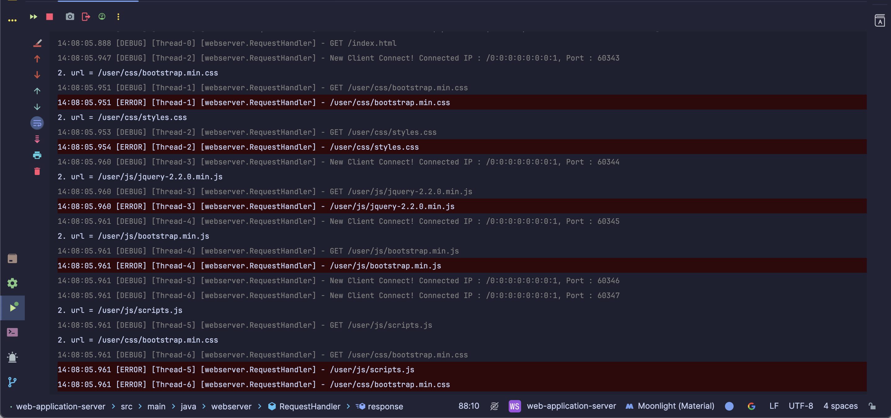

## 요구사항 2. GET 방식으로 회원가입 하기
### 처리 순서
1. `/user/create?` 을 포함하는 url 요청이 들어오면
2. 쿼리 파라미터 형태로 있는 데이터를 파싱하여 User 객체에 넣어준다
3. 생성된 User 객체를 repository에 넣어준다.
4. `/index.html`로 돌아가기


### 쿼리 파라미터 파싱하는 클래스/메서드
처음에는 split()과 for문을 사용하여 직접 파싱함.
```java
    String[] params = query.split("&");
    HashMap<String, String> pairs = new HashMap<>();
    for(String param : params){
        pairs.put(param.split("=")[0], param.split("=")[1]);
    }   
```
- 책에서 힌트로 '이름=값 파싱은 util.HttpRequestUtils 클래스의 parseQueryString() 메서드를 사용하라.'고 되어있어서 수정함.
```java
    import static util.HttpRequestUtils.parseQueryString;

    Map<String, String> pairs = parseQueryString(query);
    User user = new User(pairs.get("userId"),
            pairs.get("password"),
            pairs.get("name"),
            pairs.get("email"));
```

### 위의 4번을 처리하며 발생한 트러블 슈팅

회원 가입을 마치고 아래의 url로 요청을 보내면 

`http://localhost:8080/user/create?userId=id&password=PASSWORD&name=이영선&email=leedrkr323%40naver.com`


- RequestHandler에서 회원가입 처리를 하고 
- url을 "/index.html"로 바꿔준 뒤에
- response() 메서드를 통해 response200Header()와 responseBody() 를 호춤함

-> 그 이후의 모든 요청 앞에 /user가 붙음

-> 맨 윗줄에 GET /index.html 요청으로 로그가 찍힌 이후부터 에러 발생

-> 정확한 원인은 모르겠어서 200 응답이 아니라 302로 redirect 했더니 해결됨

- 200응답 처리 시 오류가 난 이유는 response200Header() 메서드를 사용한 후에 responseBody() 메서드를 사용하지 않아서 발생한 것 같다. (이와 관련된 커밋 기록이 남아있지 않아서 구체적인 원인은 확인 불가)